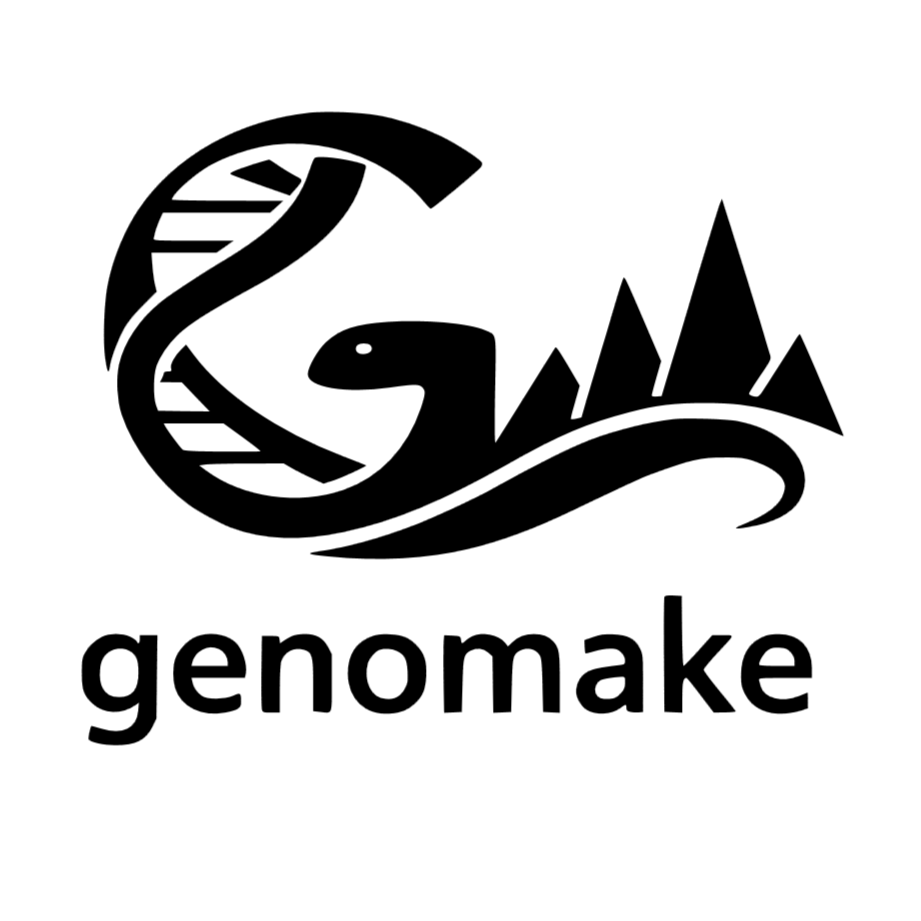

# About genomake

Genomake (genomic make) is a python package to analyze genomic data.

This package is a WIP.

Check the [documentation](https://pierre9344.github.io/genomake/) to get started.

# Current pipelines

## chromake

Chromake is a snakemake pipeline to analyze ATAC-seq and ChIP-seq sequencing experiment.

It will supports peak calling for the epigenetic marks H3K27Ac, H3K27me3, and H2Aub (H2A Ubiquitination) and for ATAC-seq experiment:

| Experiment 	| Epigenetic mark 	| Full name                                                                             	| Config recognized names 	|
|------------	|-----------------	|---------------------------------------------------------------------------------------	|-------------------------	|
| ChIP-seq   	| H3K27Ac         	| Acetylation of the lysine residue at N-terminal position 27 of the histone H3 protein 	| H3K27AC                 	|
| ChIP-seq   	| H3K27me3        	| Tri-methylation of lysine 27 on histone H3 protein                                    	| H3K27ME3                	|
| ChIP-seq   	| H2Aub           	| Histone 2A Ubiquitination                                                             	| H2AUB                   	|
| ATAC-seq   	| None            	| Assay for Transposase-Accessible Chromatin                                            	| ATAC                    	|

Steps realized:

    1. FASTQ trimming using cutadapt
    2. QC (fastqc and multiqc) of raw and trimmed fastq files.
    3. Alignment on genome (using bowtie2).
    4. Peak calling (using macs2).
    5. Read count (macs3) /!\ WIP /!\
    6. Preliminary analysis and report generation (quarto report with PCA, heatmap, and some standard QC) /!\ Not a priority. /!\
    

