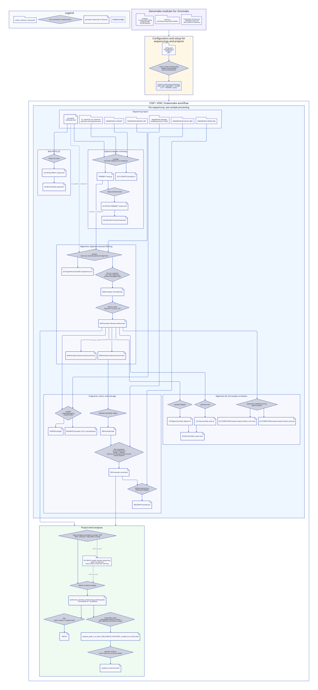

:::{.column-screen}

::: {#fig-chromake fig-cap="Graph representing the chromake pipeline. Created with d2 and the ELK engine." fig-cap-location="top"}

{width=200%}
:::

:::{.callout-note collapse=true appearance='default' icon=true}
## Code for the graph

```.d2
Legend: "Legend" {
  shape: rectangle
  style.fill: "#F8F9FA"

  config_like: "config / reference / parameter" {
    shape: package
  }

  tool_like: "rule / command / transformation" {
    shape: diamond
  }

  output_like: "persistent output file or directory" {
    shape: page
  }

  dashed: "conditional edge" {
    style.stroke-dash: 4
  }
}

PythonPackage: "Genomake modules for chromake" {
  shape: rectangle
  style.fill: "#F5F0FF"

  config_py: "config.py\n- create/check config\n- validate fields\n- fill JOB defaults" {
    shape: package
  }

  paths_py: "paths.py\ncentralized output path builders" {
    shape: package
  }

  functions_py: "snakemake_functions.py\n- scheduler resources\n- MACS2/MACS3 detection" {
    shape: package
  }
}

Config: "Configuration and setup for\nsequencings and projects" {
  shape: rectangle
  style.fill: "#FFF7E6"

  yaml: "config.yaml\nSEQUENCINGS\nPROJECTS\nJOBS" {
    shape: package
  }

  check: "check_config_format(config)\nvalidate required fields\nadd missing defaults" {
    shape: diamond
  }

  dirs: "onstart: create output directories\nBAM / BED / BEDGRAPH / HOMER\nQC/* / TRIMMED / peaks" {
    shape: rectangle
  }

  yaml -> check -> dirs
}

PythonPackage -> Config -> Pipeline

Pipeline: "ChIP / ATAC Snakemake workflow" {
  shape: rectangle
  style.fill: "#FFFFFF"

  Sequencing: "Per-sequencing / per-sample processing" {
    shape: rectangle
    style.fill: "#EEF7FF"

    Inputs: "Sequencing inputs" {
      shape: rectangle

      raw_fastq: "raw FASTQ\n{PATH}/{R1,R2}" {
        shape: page
      }

      adaptors: "R1_ADAPTOR / R2_ADAPTOR\noptional trimming parameters" {
        shape: package
      }

      cutadapt_params: "PARAMETERS.CUTADAPT" {
        shape: package
      }

      bowtie_ref: "PARAMETERS.BOWTIE2_REF" {
        shape: package
      }

      genome: "PARAMETERS.GENOME\nHOMER genome or FASTA" {
        shape: package
      }

      blacklist: "PARAMETERS.BLACKLIST_BED" {
        shape: package
      }

      chrom_size: "PARAMETERS.CHROM_SIZE" {
        shape: package
      }
    }

    RawQC: "Raw FASTQ QC" {
      shape: rectangle

      fastqc_raw: "fastqc raw reads" {
        shape: diamond
      }

      fastqc_raw_html: "QC/FASTQC/RAW/*_fastqc.html" {
        shape: page
      }

      multiqc_raw: "QC/MULTIQC/Raw_fastq.html" {
        shape: page
      }

      fastqc_raw -> fastqc_raw_html
      fastqc_raw_html -> multiqc_raw
    }

    Trimming: "Optional adapter trimming" {
      shape: rectangle

      cutadapt: "cutadapt\nonly when adapters are configured" {
        shape: diamond
      }

      trimmed_fastq: "TRIMMED/*.fastq.gz" {
        shape: page
      }

      cutadapt_log: "QC/CUTADAPT/{sample}.txt" {
        shape: page
      }

      fastqc_trimmed: "fastqc trimmed reads" {
        shape: diamond
      }

      fastqc_trimmed_html: "QC/FASTQC/TRIMMED/*_fastqc.html" {
        shape: page
      }

      multiqc_trimmed: "QC/MULTIQC/Trimmed_fastq.html" {
        shape: page
      }

      cutadapt -> trimmed_fastq
      cutadapt -> cutadapt_log
      trimmed_fastq -> fastqc_trimmed -> fastqc_trimmed_html -> multiqc_trimmed
    }

    Alignment: "Alignment, duplicate removal, filtering" {
      shape: rectangle

      align: "bowtie2\nlocal very-sensitive paired-end alignment" {
        shape: diamond
      }

      fragment_len: "QC/fragmentLen/{sample}_fragmentLen.txt" {
        shape: page
      }

      markdup_filter: "Picard + samtools\nsort, mark duplicates,\nremove unmapped reads" {
        shape: diamond
      }

      chr_header_bam: "BAM/{sample}_chrheader.bam" {
        shape: page
      }

      standard_chr_filter: "add chr prefix\nkeep chr1-22, chrX, chrY" {
        shape: diamond
      }

      coord_bam: "BAM/{sample}_filtered.coordsort.bam" {
        shape: page
      }

      coord_bai: "BAM/{sample}_filtered.coordsort.bam.bai" {
        shape: page
      }

      name_bam: "BAM/{sample}_filtered.namesort.bam" {
        shape: page
      }

      align -> fragment_len
      align -> markdup_filter -> chr_header_bam -> standard_chr_filter
      standard_chr_filter -> coord_bam
      coord_bam -> coord_bai: "samtools index"
      coord_bam -> name_bam: "samtools sort -n"
    }

    BedAndTracks: "Fragments, tracks, and coverage" {
      shape: rectangle

      homer: "HOMER\nmakeTagDirectory\nmakeUCSCfile" {
        shape: diamond
      }

      homer_dir: "HOMER/{sample}/" {
        shape: page
      }

      ucsc_bedgraph: "BEDGRAPH/{sample}_UCSC_track.bedGraph" {
        shape: page
      }

      bamtobed: "bedtools bamtobed -bedpe" {
        shape: diamond
      }

      raw_bed: "BED/{sample}.bed" {
        shape: page
      }

      clean_fragments: "filter fragments\nsame chromosome\nlength < 1000 bp\nremove non-standard chromosomes\nremove blacklist" {
        shape: diamond
      }

      sorted_bed: "BED/{sample}_sorted.bed" {
        shape: page
      }

      genomecov: "bedtools genomecov\nbedGraphToBigWig" {
        shape: diamond
      }

      bigwig: "BEDGRAPH/{sample}.bw" {
        shape: page
      }

      homer -> homer_dir
      homer -> ucsc_bedgraph

      bamtobed -> raw_bed -> clean_fragments -> sorted_bed -> genomecov -> bigwig
    }

    AlignmentQC: "Alignment QC and sample correlation" {
      shape: rectangle

      flagstat_rule: "samtools flagstat" {
        shape: diamond
      }

      flagstat: "QC/flagstat/{sample}_flagstat.txt" {
        shape: page
      }

      stats_rule: "samtools stats" {
        shape: diamond
      }

      stats: "QC/stats/{sample}_stats.txt" {
        shape: page
      }

      multiqc_bam: "QC/MULTIQC/Bam_report.html" {
        shape: page
      }

      multibamsummary: "deepTools multiBamSummary\nplotCorrelation" {
        shape: diamond
      }

      corr_matrix: "QC/CORRELATION/{sequencing}correlation_matrix.npz" {
        shape: page
      }

      corr_plot: "QC/CORRELATION/{sequencing}correlation_plot.png" {
        shape: page
      }

      flagstat_rule -> flagstat -> multiqc_bam
      stats_rule -> stats -> multiqc_bam
      multibamsummary -> corr_matrix
      multibamsummary -> corr_plot
    }

    Inputs.raw_fastq -> RawQC.fastqc_raw

    Inputs.adaptors -> Trimming.cutadapt
    Inputs.cutadapt_params -> Trimming.cutadapt
    Inputs.raw_fastq -> Trimming.cutadapt
    Inputs.raw_fastq -> Alignment.align: "no adapters configured" {
      style.stroke-dash: 4
    }
    Trimming.trimmed_fastq -> Alignment.align: "adapters configured"

    Inputs.bowtie_ref -> Alignment.align
    Inputs.genome -> BedAndTracks.homer
    Alignment.coord_bam -> BedAndTracks.homer

    Alignment.name_bam -> BedAndTracks.bamtobed
    Inputs.blacklist -> BedAndTracks.clean_fragments
    Inputs.chrom_size -> BedAndTracks.genomecov

    Alignment.coord_bam -> AlignmentQC.flagstat_rule
    Alignment.coord_bam -> AlignmentQC.stats_rule
    Alignment.coord_bam -> AlignmentQC.multibamsummary
  }

  Projects: "Project-level analyses" {
    shape: rectangle
    style.fill: "#EFFAF0"

    SampleSelection: "Select samples associated to a project TYPE\nATAC / H3K27AC / H3K27ME3 / H2AUB" {
      shape: diamond
    }

    InputsForChIP: "first INPUT sample .bed per sequencing\n(other are ignored)\nused as MACS control for ChIP-seq" {
      shape: package
    }

    MACS: "MACS2 or MACS3 callpeak" {
      shape: diamond
    }

    PeakFiles: "peaks/macs_{project}_{sequencing}_{sample}_peaks\n*.narrowPeak or *.broadPeak" {
      shape: page
    }

    FRIPRule: "FRiP\nreads in peaks / mapped reads" {
      shape: diamond
    }

    FRIP: "FRIP.txt" {
      shape: page
    }

    MergeFilterPeaks: "merge/filter peaks\nkeep peaks present in at least\nMIN_SAMPLES_FOR_PEAKS samples" {
      shape: diamond
    }

    ConsensusPeaks: "{project}_peaks_in_at_least_<MIN_SAMPLES_FOR_PEAKS>_samples_for_multicov.bed" {
      shape: page
    }

    Multicov: "bedtools multicov\ncount reads over consensus peaks" {
      shape: diamond
    }

    CountMatrix: "{project}_countmatrix.bed" {
      shape: page
    }

    SampleSelection -> MACS
    SampleSelection -> InputsForChIP: "ChIP-seq only" {
      style.stroke-dash: 4
    }
    InputsForChIP -> MACS: "ChIP-seq only" {
      style.stroke-dash: 4
    }

    MACS -> PeakFiles
    PeakFiles -> MergeFilterPeaks -> ConsensusPeaks
    PeakFiles -> FRIPRule -> FRIP

    ConsensusPeaks -> Multicov -> CountMatrix
  }

  Sequencing.BedAndTracks.sorted_bed -> Projects
  Sequencing.Alignment.coord_bam -> Projects
}
```

:::

:::
