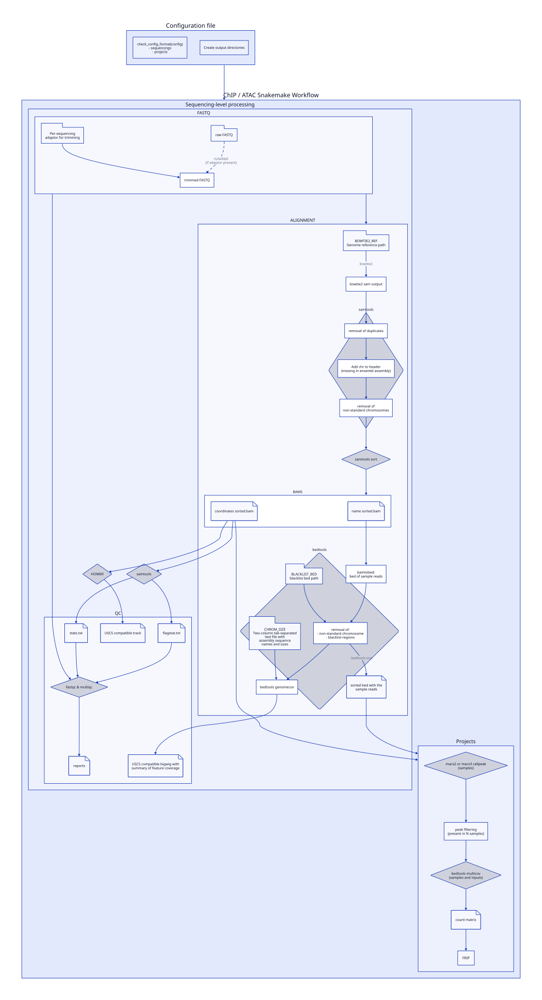

::: {#fig-chromake fig-cap="Graph representing the chromake pipeline. Created with d2 and the dagre engine." fig-cap-location="top"}



:::

:::{.callout-note collapse=true appearance='default' icon=true}
## Code for the graph (note)

```.d2
Config: Configuration file {
  shape: rectangle
  ConfigCheck: "check_config_format(config)\n- sequencings\n- projects"
  Directories: "Create output directories"
}

Config -> Pipeline

Pipeline: ChIP / ATAC Snakemake Workflow {
  shape: rectangle
  Sequencing: Sequencing-level processing {
    shape: rectangle
    FASTQ: {
      shape: rectangle
      fastq: "raw FASTQ" {
        shape: package
      }
      trimmed_fastq: "trimmed FASTQ"
      fastq -> trimmed_fastq: "cutadapt\n(if adaptor present)" {
        style.stroke-dash: 5
      }
      ADAPTOR: Per-sequencing\nadaptor for trimming {
        shape: package
      }
      ADAPTOR -> trimmed_fastq
    }
    ALIGNMENT: {
      shape: rectangle
      GENOME_REF: "BOWTIE2_REF\nGenome reference path" {
        shape: package
      }
      GENOME_REF -> SAM: bowtie2
      SAM: "bowtie2 sam output"
      FILTERING: samtools {
        shape: diamond
        REMOVE_DUP: removal of duplicates
        ADD_CHR: Add chr to header\n(missing in ensembl assembly)
        REMOVE_NON_STD: removal of\nnon-standard chromosomes
      }
      BAMS: {
        coordsort: coordinates sorted.bam {shape: page}
        namesort: name sorted.bam {shape: page}
      }
      SAM -> FILTERING.REMOVE_DUP -> FILTERING.ADD_CHR -> FILTERING.REMOVE_NON_STD
      BEDTOOLS: bedtools {
        shape: diamond
        bamtobed: bamtobed:\nbed of sample reads
        removal: removal of:\n - non-standard chromosome\n - blacklist-regions
        sorting: sorted bed with the\nsample reads {shape: page}
        genomecov: bedtools genomecov
        bamtobed -> removal
        removal -> sorting: bedtools sort

        removal -> genomecov
        BLACKLIST: "BLACKLIST_BED\nblacklist bed path" {
          shape: package
        }
        CHROM_SIZE: "CHROM_SIZE\nTwo-column tab-separated\ntext file with\nassembly sequence\nnames and sizes" {
          shape: package
        }
        CHROM_SIZE -> genomecov
        BLACKLIST -> removal
      }
      BAMS.namesort -> BEDTOOLS.bamtobed

      samtools_sort: samtools sort {
        shape: diamond
      }
      FILTERING.REMOVE_NON_STD -> samtools_sort -> BAMS
    }
    QC: {
      shape: rectangle
      flagstat: "flagstat.txt" {shape: page}
      stats: "stats.txt" {shape: page}
      fastqc: "fastqc & multiqc" {
        shape: diamond
      }
      reports: reports {shape: page}
      fastqc -> reports
      UCSC_HOMER: USCS compatible track {shape: page}
      UCSC_2: USCS compatible bigwig with\nsummary of feature coverage {shape: page}
    }
    samtools: {
      shape: diamond
    }
    HOMER: {
      shape: diamond
    }
    FASTQ -> ALIGNMENT
    ALIGNMENT.BAMS.coordsort -> samtools -> QC.flagstat -> QC.fastqc
    samtools -> QC.stats -> QC.fastqc
    ALIGNMENT.BAMS.coordsort -> HOMER -> QC.UCSC_HOMER
    FASTQ -> QC.fastqc
    ALIGNMENT.BEDTOOLS.genomecov -> QC.UCSC_2
  }
  Projects: "Projects" {
    macs: macs2 or macs3 callpeak\n (samples) {shape: diamond}
    filtering: peak filtering\n(present in N samples)
    multicov: bedtools multicov\n(samples and inputs) {shape: diamond}
    count_matrix: count matrix {shape: page}
    FRIP
    macs -> filtering -> multicov -> count_matrix -> FRIP
  }
  Sequencing.ALIGNMENT.BEDTOOLS.sorting -> Projects
  Sequencing.ALIGNMENT.BAMS.coordsort -> Projects
}
```

:::
